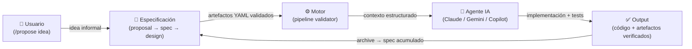

# 007 — Forge Showcase: Repositorio público de exhibición e integración en locus

## Why

Forge es el motor del portafolio y la herramienta que impulsa el propio pipeline de locus.
La página `docs/forge/index.md` describe con precisión el sistema (SDD, artefactos, CLI,
jerarquía de conocimiento), pero no ofrece ningún artefacto inspeccionable. El código fuente
es privado por razones de propiedad intelectual y seguridad operacional.

Un repositorio de exhibición resuelve esta tensión: publica la arquitectura del pipeline,
la topología de directorios y la configuración de desarrollo declarativa —la parte que
demuestra pensamiento de diseño— sin revelar lógica de orquestación, implementaciones
del motor de agentes ni configuración privada de entornos.

La integración en locus cierra el ciclo: la página de Forge apunta directamente al
showcase, convirtiendo la descripción en evidencia tangible.

---

## What Changes

### 1. Artefactos del Showcase (DESTINO: `~/BenjaLabs/showcase/forge-showcase/`)

#### `README.md`

```markdown
> [!IMPORTANT]
> **Repositorio de Exhibición — Código Fuente Privado**
> Este repositorio contiene únicamente documentación de arquitectura,
> la topología de directorios del proyecto y un entorno de desarrollo de referencia.
> El código fuente de Forge (Python) es privado.
> Para consultas sobre el proyecto contactar: github.com/Bajmein

# Forge

**Pipeline estructurado para desarrollo asistido por IA.**

Forge resuelve un problema específico: el desarrollo con agentes de IA es potente
pero caótico. Sin estructura, los cambios son difíciles de rastrear, reproducir
o revisar. Forge introduce un pipeline guiado por esquemas que convierte ideas
en código verificado de forma sistemática.

## Spec-Driven Development (SDD)

Cada cambio en Forge avanza a través de fases explícitas, cada una produciendo
un artefacto validado contra un esquema YAML:



El pipeline completo:

```
Propuesta → Especificación → Diseño → Tareas → Implementación → Verificación → Archivo
```

Cada etapa produce un artefacto con frontmatter YAML. Los artefactos son la fuente
de verdad; los agentes son ejecutores. La estructura garantiza reproducibilidad
entre sesiones, herramientas y colaboradores.

## Arquitectura de Conocimiento

Forge define una jerarquía explícita para que los agentes sepan dónde buscar contexto:

| Prioridad | Fuente         | Uso                                        |
| --------- | -------------- | ------------------------------------------ |
| 1 (alta)  | **Notion**     | Especificaciones oficiales y documentación |
| 2 (media) | **Obsidian**   | ADRs, patrones internos, contexto local    |
| 3 (baja)  | **Filesystem** | Artefactos del cambio activo               |

## Flujo de Comandos (Slash CLI)

Forge se orquesta mediante comandos slash dentro del cliente IA:

```text
/propose [idea]        # Genera propuesta inicial (crea NNN-slug)
/specify <id>          # Genera especificación desde la propuesta
/design <id>           # Genera diseño técnico
/break-to-tasks <id>   # Desglosa diseño en tareas ejecutables
/approve <id>          # Aprueba cambio propuesto
/apply <id>            # Implementa las tareas en un git worktree
/verify <id>           # Valida implementación y corre tests
/archive <id>          # Archiva cambio y consolida especificaciones
```

Atajos de velocidad:

```text
/fast-draft [idea]     # Propuesta + spec en una sola operación
/fast-plan <id>        # Diseño + tareas en una sola operación
```

## Stack

| Componente    | Tecnología                                      |
| ------------- | ----------------------------------------------- |
| Artefactos    | YAML schemas + Markdown                         |
| Desarrollo    | Python 3.14+, mise, uv, ruff, dprint            |
| Validación    | pytest, bandit, ty, vulture, deptry             |
| MCP Servers   | context7, github, serena, obsidian              |
| Clientes IA   | Claude Code, Gemini CLI, GitHub Copilot         |

## Estado

En desarrollo activo — v0.1.0. El pipeline completo (propose → archive) está
operativo. En uso como infraestructura del portafolio y proyectos propios.

## Licencia

El código fuente no está disponible en este repositorio.
Los artefactos de documentación y arquitectura son © Bajmein.
```

---

#### `tree_structure.txt`

```text
forge/
├── .agents/
│   └── skills/
│       ├── pipeline/          # Skills del ciclo de vida: propose, specify, design, apply…
│       ├── shared/            # Directivas y contexto compartido entre agentes
│       └── utility/           # Skills utilitarios: explore, serena-init, semantic-edit…
│
├── .engine/
│   ├── changes/               # Directorios NNN-slug/ por cada cambio activo
│   │   └── archive/           # Cambios completados y archivados
│   ├── ideas/                 # Borradores de propuestas (pre-pipeline)
│   ├── schemas/               # Schemas YAML — fuente de verdad de artefactos
│   └── specs/                 # Especificaciones acumuladas (post-archive)
│
├── docs/                      # Documentación técnica del proyecto
│   ├── autopilot.md           # Guía de modo autónomo
│   ├── busqueda.md            # Estrategias de búsqueda en el codebase
│   ├── codemaps.md            # Mapas de navegación del código
│   ├── config.md              # Referencia de configuración
│   ├── contexto.md            # Arquitectura de conocimiento
│   ├── convenciones.md        # Convenciones del proyecto
│   ├── integraciones.md       # Guía de integraciones externas
│   ├── memoria.md             # Sistema de memoria de agentes
│   ├── modulos.md             # Descripción de módulos internos
│   ├── pipeline.md            # Referencia completa del pipeline SDD
│   ├── sdk.md                 # Referencia del SDK de agentes
│   └── skills.md              # Catálogo de skills disponibles
│
├── src/
│   └── forge/                 # Código fuente (privado — no incluido en showcase)
│
├── tests/                     # Tests de validación (privado — no incluido en showcase)
│
├── AGENTS.md                  # Instrucciones para agentes IA
├── CHANGELOG.md               # Historial de versiones
├── CLAUDE.md                  # Configuración específica para Claude Code
├── dprint.json                # Configuración de formateo Markdown/TOML
├── llms.txt                   # IDs de librerías para Context7 MCP
├── mise.toml                  # Orquestador de tareas y entorno de desarrollo
├── pyproject.toml             # Metadatos del proyecto y dependencias
└── README.md                  # Documentación principal
```

---

#### `mise.toml` (saneado — sin vars privadas ni rutas de entorno)

```toml
# https://mise.jdx.dev
# Forge — Development Environment Configuration
# This is a sanitized reference version. Private vars and .env loading removed.

[tools]
python = "3.14"
uv     = "latest"
ruff   = "latest"
dprint = "latest"

# Dev tasks ==========================================

[tasks.default]
description = "Lista todas las tareas disponibles"
run         = "mise tasks"

[tasks.install]
description = "Instala dependencias del proyecto"
run         = "uv sync --all-groups"

[tasks.lint]
description = "Ejecuta linters (ruff, deptry, vulture)"
run         = """
uv run ruff check src tests
uv run deptry src
uv run vulture src tests --min-confidence 80
"""

[tasks.format]
description = "Formatea el código"
run         = """
uv run ruff format src tests
uv run dprint fmt
"""

[tasks.test]
description = "Ejecuta tests"
run         = "uv run pytest"

[tasks.security]
description = "Análisis de seguridad"
run         = "uv run bandit -r src -ll"

[tasks.typecheck]
description = "Verificación de tipos"
run         = "uv run ty check src"

[tasks.check]
description = "Ejecuta todos los checks (lint + test + security + types)"
depends     = ["lint", "test", "security", "typecheck"]
```

> **Nota de sanitización**: Se omitieron `[vars]` (contiene `github_username` privado),
> la directiva `_.python.venv` y la carga automática de `.env` (`_.file = ".env"`).
> El archivo de producción gestiona estas variables como parte de la configuración
> local no versionada.

---

### 2. Integración en locus (`docs/forge/index.md`)

Insertar el siguiente bloque **antes de la última sección `## Más sobre Forge`**
(antes de la línea 114 del archivo actual):

```markdown
---

## Repositorio Vitrina

El código fuente de Forge es privado. Para demostrar la arquitectura del pipeline,
la topología de directorios y el entorno de desarrollo, se mantiene un repositorio
de exhibición con documentación técnica y artefactos de referencia.

[Ver repositorio vitrina en GitHub](https://github.com/Bajmein/forge-showcase){ .md-button }

---
```

---

### 3. Secuencia de Comandos de Infraestructura

Ejecutar **una vez aprobada la propuesta**, en el directorio DESTINO:

```bash
# 1. Crear directorio e inicializar repositorio local
mkdir -p ~/BenjaLabs/showcase/forge-showcase
cd ~/BenjaLabs/showcase/forge-showcase
git init
git branch -M main

# 2. Crear los artefactos (README.md, tree_structure.txt, mise.toml)
#    → Contenido definido en la sección "Artefactos del Showcase" de esta propuesta

# 3. Primer commit
git add README.md tree_structure.txt mise.toml
git commit -m "feat: initial forge showcase — architecture docs and dev environment reference"

# 4. Crear repositorio público en GitHub y vincular origen
gh repo create Bajmein/forge-showcase \
  --public \
  --description "Forge — SDD pipeline showcase. Source code is private. Architecture docs and dev tooling reference." \
  --homepage "https://bajmein.github.io/locus/forge/" \
  --source . \
  --remote origin \
  --push
```

---

## Capabilities

- **showcase-repo**: Repositorio público `forge-showcase` con README técnico completo,
  banner de exhibición, diagrama Mermaid del flujo SDD (Usuario → Spec → Motor → Agente → Output)
  y referencia del CLI de comandos slash.
- **tree-reference**: `tree_structure.txt` con la topología de directorios anotada
  (`.agents/`, `.engine/`, `docs/`, `src/`, `tests/`) que demuestra la separación
  arquitectónica sin exponer código fuente.
- **tooling-reference**: `mise.toml` saneado que muestra la gestión de dependencias y
  el pipeline de validación (lint + test + security + typecheck) con Python 3.14+.
- **locus-link**: Enlace directo al showcase desde `docs/forge/index.md` con botón
  Material, cerrando el ciclo portafolio → evidencia pública.
- **zero-trust-filtering**: Ningún artefacto del showcase contiene código fuente Python,
  rutas locales privadas, tokens de API ni configuración de entorno sensible.

## Impact

- **Archivos modificados en locus**: `docs/forge/index.md` (adición de sección + botón).
  Sin cambios en `mkdocs.yml` (la página ya existe en nav).
- **Nuevo repositorio**: `~/BenjaLabs/showcase/forge-showcase/` (3 archivos,
  repositorio público en GitHub bajo cuenta `Bajmein`).
- **Sin breaking changes**: La página de Forge en locus solo crece; los tests SEO
  existentes no se ven afectados (frontmatter sin cambios).
- **Riesgo cero de exposición**: Los artefactos del showcase se crean desde cero
  aplicando las reglas Zero Trust de esta propuesta; no se copian archivos del ORIGEN.
- **CI/CD**: El push de `docs/forge/index.md` activa el pipeline de GitHub Actions
  de locus de forma normal.
