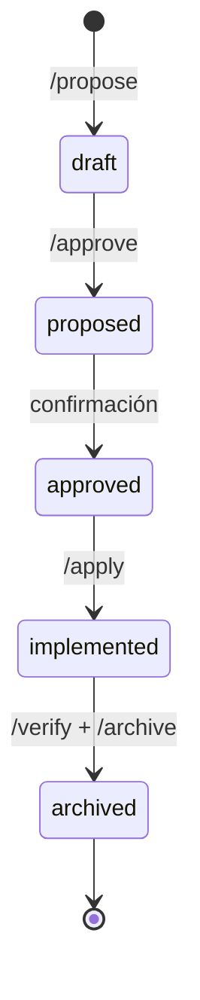

# Forge

**Arquitectura industrial de Spec-Driven Development para desarrollo autónomo con agentes de IA.**

Forge resuelve un problema específico: el desarrollo con agentes de IA es potente pero caótico. Sin estructura, los cambios son difíciles de rastrear, reproducir o revisar. Forge no es un framework genérico de agentes, sino una arquitectura industrial que introduce un pipeline schema-driven con garantías formales, convirtiendo ideas en código verificado de forma sistemática.

---

## El Problema

Los flujos de trabajo con IA generativa para código tienden a ser ad-hoc:
instrucciones informales, contexto implícito y cambios sin trazabilidad. Esto
funciona para tareas aisladas, pero falla cuando el software crece y el equipo
necesita reproducibilidad, revisión y consistencia.

## La Solución

Forge define un **ciclo de vida explícito** para cada cambio de software:



Cada etapa produce un artefacto validado contra un esquema YAML. Los agentes de IA actúan como ejecutores de cada fase; los artefactos son la fuente de verdad. 

Este paradigma agent-native implica que la ausencia de un runtime de Python propio no es una limitación, sino una decisión de diseño deliberada. Forge es pura orquestación de agentes sobre artefactos Markdown y YAML.

---

## El Mecanismo

El corazón del sistema de conocimiento de Forge son las delta specs con acumulación semántica. En lugar de modificar especificaciones globales directamente, cada cambio produce un delta spec enfocado únicamente en lo que altera. Al finalizar el ciclo de vida, durante la fase de archivo, estos fragmentos se integran al spec acumulado del proyecto.

```yaml
# .engine/changes/NNN-feature-name/specs/domain/spec.md
---
type: spec
domain: content
status: draft
author: claude-sonnet-4-6
created_at: 2026-04-07
proposal: ../../../proposal.md
---

## ADDED Requirements

### Requirement: Página de Documentación — Nueva sección de ejemplos

La página SHALL incluir ejemplos sanitizados de uso.

#### Scenario: Sección de ejemplos presente

**GIVEN** el archivo `docs/example/page.md`
**WHEN** se verifica el contenido
**THEN** existe la sección con el contenido requerido
```

---

## Garantías de Calidad

- **BDD Formal:** El uso de escenarios GIVEN/WHEN/THEN no es una convención opcional, sino el mecanismo formal de requisitos que garantiza que todo cambio sea verificable antes de ser implementado.
- **Validación Estructural:** Los esquemas YAML proveen validación estricta para todos los artefactos del pipeline (proposals, specs, tasks), asegurando consistencia entre proyectos y agentes.
- **TDD Enforced:** El ciclo de desarrollo guiado por pruebas (Test-Driven Development) es obligatorio durante `/apply`. Ningún cambio se considera completo sin su correspondiente validación automatizada.

---

## Trazabilidad y Aislamiento

El pipeline de Forge está construido sobre una postura zero-trust que garantiza seguridad y aislamiento:

- **FSM como Audit Trail:** El flujo de estados (`draft → proposed → approved → implemented → archived`) actúa como un rastro de auditoría completo e inmutable para cada cambio en el sistema.
- **Aislamiento por Worktree:** Cada ejecución de `/apply` crea un entorno git worktree completamente aislado para el cambio en curso. Al completarse con éxito, el comando `/archive` se encarga de limpiar el entorno automáticamente.

---

## Jerarquía de Conocimiento

| Tier | Sistema | Rol | Consultado cuando… |
| --- | --- | --- | --- |
| 1 | Notion | Fuente oficial de especificaciones | Hay requisitos de negocio o decisiones de producto |
| 2 | Obsidian | Base de conocimiento interna (ADRs, contexto) | Se requiere contexto arquitectónico o de decisiones pasadas |
| 3 | Filesystem | Artefactos activos del pipeline | Se está trabajando en un cambio en curso |
| 4 | Context7 | Documentación de librerías y APIs | Se implementa código con dependencias externas |

---

## Capacidades

<div class="grid cards" markdown>

- ## **Pipeline schema-driven**
  Cada cambio avanza a través de fases con artefactos validados
  (`proposal.md`, `spec.md`, `design.md`, `tasks.md`). Los esquemas garantizan
  consistencia entre proyectos y agentes.

- ## **Multi-agente y multi-CLI**
  Compatible con Claude Code, Gemini CLI y GitHub Copilot como motores de
  ejecución. El pipeline es agnóstico al agente: los comandos `/propose`,
  `/apply`, `/verify` funcionan con cualquier cliente compatible.

- ## **Jerarquía de conocimiento estructurada**
  Notion como fuente oficial de especificaciones, Obsidian para contexto interno
  y el filesystem para artefactos activos. Los agentes saben exactamente dónde
  buscar y en qué orden.

- ## **Sin runtime propio**
  Forge no tiene un servidor ni proceso de fondo. Es pura configuración:
  esquemas YAML, prompts Markdown y convenciones de directorio. Ligero,
  portable y versionable en git.

- ## **Trazabilidad por diseño**
  Cada cambio tiene su propio directorio `NNN-slug/` con historia completa.
  El archivo consolida las especificaciones en un spec acumulado del proyecto.

- ## **Flujo rápido integrado**
  Los comandos `/fast-draft` y `/fast-plan` permiten pasar de idea a diseño
  con tareas ejecutables en una sola operación, sin saltarse la validación.

</div>

---

## Stack

| Componente | Tecnología                           |
| ---------- | ------------------------------------ |
| Artefactos | YAML + Markdown                      |
| Desarrollo | Python 3.14+, mise, uv, ruff, dprint |
| Validación | pytest, bandit, ty, vulture          |
| MCP        | context7, github, serena, obsidian   |

---

## Estado del Proyecto

!!! info "En desarrollo activo — v0.1.0"

    Forge está en uso activo en proyectos propios. El pipeline completo
    (propose → archive) está operativo. La integración con Notion y la
    expansión a más CLIs son áreas de mejora continua.

---

## Repositorio Vitrina

El código fuente de Forge es privado. Para demostrar la arquitectura del pipeline,
la topología de directorios y el entorno de desarrollo, se mantiene un repositorio
de exhibición con documentación técnica y artefactos de referencia.

[Ver repositorio vitrina en GitHub](https://github.com/Bajmein/forge-showcase){ .md-button }

---

## Más sobre Forge

Forge es la infraestructura que impulsa el proceso de desarrollo de este
mismo portafolio y de otros proyectos en el repositorio. La sección
[Laboratorio](/laboratorio/) recoge experimentos y aprendizajes surgidos
de su uso.

Forge está diseñado para orquestar proyectos de alta complejidad como
Vigilia — sistemas **híbridos Python/Rust** donde los cambios cruzan la
frontera entre módulos nativos compilados y la capa de orquestación en Python.
El pipeline schema-driven garantiza trazabilidad completa incluso cuando un
mismo cambio afecta al núcleo Rust, los bindings PyO3 y la configuración
Hydra simultáneamente.