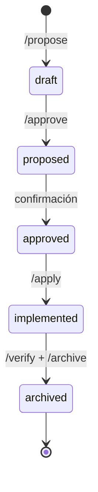

# Forge

**Herramienta personal de Spec-Driven Development para desarrollo con agentes de IA.**

---

## El Problema

El desarrollo ad-hoc con IA funciona para tareas aisladas, pero falla cuando el proyecto crece: sin estructura, los cambios son difíciles de rastrear, reproducir o revisar.

## La Solución

Forge introduce un pipeline estructurado que convierte ideas en código verificado de forma sistemática. Cada cambio avanza a través de fases con artefactos validados; los agentes de IA actúan como ejecutores, no como árbitros.

---

## El Ciclo de Vida

Forge define un ciclo de vida explícito para cada cambio de software:

Cada etapa produce un artefacto validado contra un esquema YAML. Los agentes de IA actúan como ejecutores de cada fase; los artefactos son la fuente de verdad.

---

## Capacidades

- ## **Pipeline schema-driven**
  Cada cambio avanza a través de fases con artefactos validados
  (`proposal.md`, `spec.md`, `design.md`, `tasks.md`). Los esquemas garantizan
  consistencia entre proyectos y agentes.

- ## **Multi-agente y multi-CLI**
  Compatible con Claude Code, Gemini CLI y GitHub Copilot como motores de
  ejecución. El pipeline es agnóstico al agente.

- ## **Sin runtime propio**
  Forge no tiene un servidor ni proceso de fondo. Es pura configuración:
  esquemas YAML, prompts Markdown y convenciones de directorio. Ligero,
  portable y versionable en git.

- ## **Trazabilidad por diseño**
  Cada cambio tiene su propio directorio `NNN-slug/` con historia completa.
  El archivo consolida las especificaciones en un spec acumulado del proyecto.

- ## **Flujo rápido integrado**
  Los comandos `/fast-draft` y `/fast-plan` permiten pasar de idea a diseño
  con tareas ejecutables en una sola operación, sin saltarse la validación.

---

## Stack

| Componente | Tecnología                           |
| ---------- | ------------------------------------ |
| Artefactos | YAML + Markdown                      |
| Desarrollo | Python 3.14+, mise, uv, ruff, dprint |
| Validación | pytest, bandit, ty, vulture          |
| MCP        | context7, github, serena, obsidian   |

---

## Estado del Proyecto

!!! info "En desarrollo activo — v0.1.0"

    Forge está en uso activo en proyectos propios. El pipeline completo
    (propose → archive) está operativo.

---

## Repositorio Vitrina

El código fuente de Forge es privado. Para demostrar la arquitectura del pipeline,
la topología de directorios y el entorno de desarrollo, se mantiene un repositorio
de exhibición con documentación técnica y artefactos de referencia.

[Ver repositorio vitrina en GitHub](https://github.com/Bajmein/forge-showcase){ .md-button }

---

## Más sobre Forge

Forge es la infraestructura que impulsa el proceso de desarrollo de este
mismo portafolio y de otros proyectos en el repositorio.
