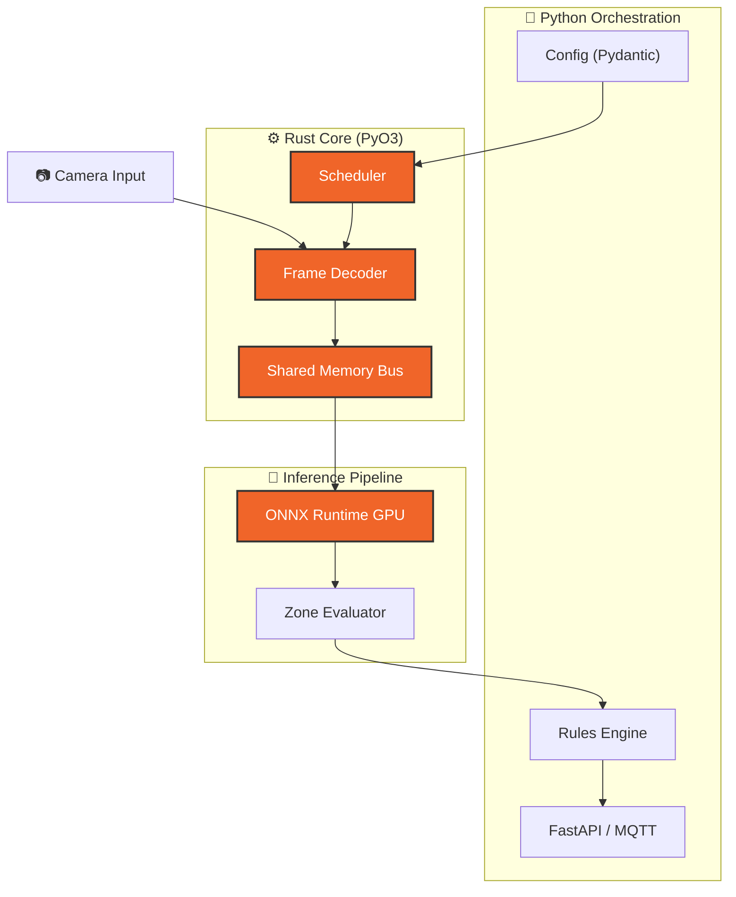

# Vigilia Reforged

**De la vigilancia pasiva al monitoreo inteligente y proactivo.**

Vigilia es una plataforma de seguridad que transforma flujos de video en
inteligencia operativa en tiempo real. En lugar de grabar para revisar después
de un incidente, Vigilia analiza, decide y actúa mientras los eventos ocurren.

---

## El Problema

Los sistemas de CCTV tradicionales son reactivos por diseño: almacenan video
que alguien revisa después. Esto tiene un costo operativo alto y una tasa de
respuesta baja. La mayoría de los incidentes no se detectan a tiempo no por
falta de cámaras, sino por falta de capacidad para procesar lo que capturan.
Cada minuto de retraso en la detección tiene un coste real: horas de revisión
post-incidente, valor perdido y, en el peor caso, daños que una respuesta
automática hubiera evitado.

## La Solución

El objetivo es responder automáticamente antes de que el incidente escale — un SLA
que los sistemas reactivos no pueden cumplir. Rust e Iceoryx son la elección
pragmática que hace posible ese SLA: no una preferencia tecnológica, sino la
combinación que elimina los cuellos de botella de serialización y latencia que
impedirían la respuesta en tiempo real.

Vigilia procesa video en tiempo real con aceleración por hardware, aplica
reglas espaciales configurables y dispara respuestas automáticas ante eventos
relevantes — sin intervención humana constante y sin latencia perceptible.

```
Ingestión → Análisis en tiempo real → Evaluación de reglas → Acción
```

El operador define qué importa (zonas, comportamientos, umbrales); el sistema
se encarga del resto.

### Arquitectura del Pipeline de Alta Performance

Tres crates Rust especializados gestionan la ingestión, el IPC y el control del
pipeline. Python orquesta la lógica de negocio sin intervenir en los hot paths de GPU.

```
┌─────────────────────────────────────────────────────────┐
│  vigilia-nvdec (Rust)                                   │
│  NVDEC hardware decode → PTX color convert → IPC publish│
├─────────────────────────────────────────────────────────┤
│  vigilia-ipc (Rust)                                     │
│  Iceoryx2 IPC bus — 192-byte ABI — VRAM watchdog        │
├─────────────────────────────────────────────────────────┤
│  vision_core (Rust)                                     │
│  Reactive RPC server (Iceoryx2 RPC) — command handler  │
├─────────────────────────────────────────────────────────┤
│  Python Layer                                           │
│  NvEnc recording · ONVIF · MQTT · WHEP · PySide6       │
└─────────────────────────────────────────────────────────┘
```

> **Rust-powered core** — Pipeline zero-copy con **Iceoryx2** como bus IPC shared-memory
> (descriptor de 192 bytes, lock-free queues, sin serialización ni round-trip al broker),
> **NVDEC** para decodificación hardware en GPU con conversión de espacio de color en-device
> vía PTX kernels (NV12→RGB_F32, sin round-trip a CPU), y un **VRAM watchdog** que consulta
> el estado del hardware para liberar buffers GPU de forma determinista — sin GC, sin reference
> counting en hot paths.



---

## Capacidades

<div class="grid cards" markdown>

- ## **Detección en tiempo real**
  Análisis continuo de video con aceleración GPU. Baja latencia desde la
  captura hasta la decisión, diseñado para entornos donde cada segundo cuenta.

- ## **Zonas de seguridad configurables**
  Define áreas de interés con geometría arbitraria: zonas de intrusión,
  perímetros de cruce, regiones de exclusión. Las reglas son declarativas y
  no requieren programación.

- ## **Sistema de alertas multi-canal**
  Cuando se detecta un evento de seguridad, Vigilia puede responder de forma
  coordinada: disuasión de audio, notificaciones a sistemas externos e
  integración con plataformas de gestión de video existentes.

- ## **Integración con ecosistemas VMS**
  Exporta metadatos de analítica hacia sistemas de gestión de video (VMS)
  mediante protocolos estándar de la industria — sin lock-in a un proveedor
  específico.

- ## **Acceso remoto seguro**
  Monitoreo en tiempo real desde cualquier ubicación con acceso cifrado de
  extremo a extremo. Sin necesidad de exponer puertos ni depender de
  servicios en la nube de terceros.

- ## **Interfaz de escritorio nativa**
  Aplicación desktop de alto rendimiento con visualización de video en vivo,
  gestión de zonas y estado del sistema — diseñada para operadores que
  necesitan control directo y bajo consumo de recursos.

- ## **Optimización de almacenamiento basada en eventos**
  El sistema graba con inteligencia selectiva: prioriza y persiste los
  segmentos asociados a eventos detectados, reduciendo el volumen de
  almacenamiento sin sacrificar la evidencia que realmente importa.

</div>

---

## Stack

| Componente       | Tecnología                                    |
| ---------------- | --------------------------------------------- |
| IPC bus          | Iceoryx2 (Rust) — zero-copy shared memory, 192-byte ABI |
| Decodificación   | NVDEC + PTX (Rust) — hardware decode + color convert en GPU |
| Grabación GPU    | NvEnc (Python/CUDA) — hardware encode asíncrono |
| Core de análisis | Rust (seguridad de memoria, rendimiento determinista) |
| Orquestación     | Python 3.13+, Pydantic v2                     |
| Interfaz         | PySide6 (Qt nativo)                           |
| Integraciones    | ONVIF Profile M, MQTT                         |
| Acceso remoto    | Tailscale, WebRTC/WHEP                        |
| Tooling          | mise, uv, ruff, dprint                        |

!!! note "Decisiones de diseño"

    - **Iceoryx2 vs MQTT para IPC interno**: MQTT agrega latencia de serialización y
      round-trip al broker. Iceoryx2 usa shared memory con lock-free queues — los mensajes
      entre `vigilia-nvdec` y `vision_core` no pasan por ninguna capa de red.
    - **NVDEC vs software decode**: La decodificación software en CPU consume ciclos que
      compiten con inferencia. NVDEC libera la CPU completamente y mantiene los frames en
      VRAM a lo largo de todo el pipeline.
    - **VRAM watchdog pattern**: La gestión de buffers GPU consulta el estado del hardware
      antes de liberar memoria — garantía de seguridad sin overhead de sincronización.

---

## Estado del Proyecto

!!! info "Desarrollo activo — v0.8.1"

    Vigilia está en desarrollo activo con el pipeline de análisis, las
    integraciones VMS y el acceso remoto ya operativos. La plataforma se
    utiliza en entornos de prueba controlados. Las siguientes áreas de
    expansión incluyen modelos de alerta más granulares y mejoras en la
    experiencia de configuración de zonas.

---

## Repositorio Vitrina

El código fuente de Vigilia es privado. Para demostrar la arquitectura y el diseño
del sistema de forma pública, se mantiene un repositorio de exhibición con la
documentación técnica, el diagrama del pipeline y las plantillas de configuración.

[Ver repositorio vitrina en GitHub](https://github.com/Bajmein/vigilia-reforged-showcase){ .md-button }

---

## Más sobre Vigilia

El desarrollo de Vigilia sigue el pipeline de [Forge](/forge/), lo que permite
gestionar cambios complejos en un sistema multi-lenguaje con trazabilidad
completa desde la idea hasta el código verificado.
