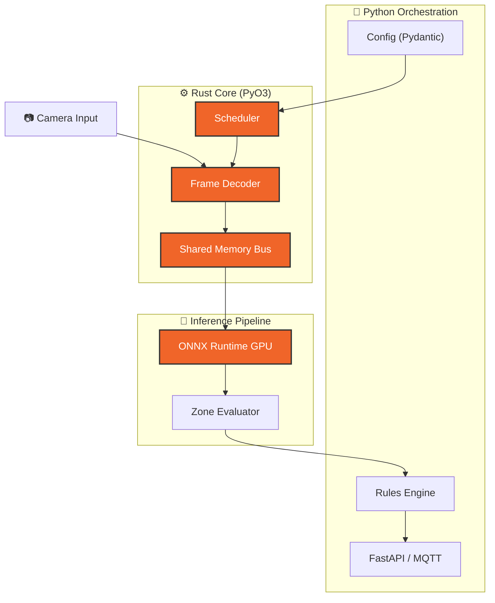

# Vigilia Reforged

**De la vigilancia pasiva al monitoreo inteligente y proactivo.**

Vigilia es una plataforma de seguridad que transforma flujos de video en
inteligencia operativa en tiempo real. En lugar de grabar para revisar después
de un incidente, Vigilia analiza, decide y actúa mientras los eventos ocurren.

---

## El Problema

Los sistemas de CCTV tradicionales son reactivos por diseño: almacenan video
que alguien revisa después. Esto tiene un costo operativo alto y una tasa de
respuesta baja. La mayoría de los incidentes no se detectan a tiempo no por
falta de cámaras, sino por falta de capacidad para procesar lo que capturan.

## La Solución

El objetivo es responder automáticamente antes de que el incidente escale.
Vigilia procesa video en tiempo real con aceleración por hardware, aplica
reglas espaciales configurables y dispara respuestas automáticas ante eventos
relevantes — sin intervención humana constante.

```
Ingestión → Análisis en tiempo real → Evaluación de reglas → Acción
```

El operador define qué importa (zonas, comportamientos, umbrales); el sistema
se encarga del resto.



---

## Capacidades

<div class="grid cards" markdown>

- ## **Detección en tiempo real**
  Análisis continuo de video con aceleración GPU. Baja latencia desde la
  captura hasta la decisión, diseñado para entornos donde cada segundo cuenta.

- ## **Zonas de seguridad configurables**
  Define áreas de interés con geometría arbitraria: zonas de intrusión,
  perímetros de cruce, regiones de exclusión. Las reglas son declarativas y
  no requieren programación.

- ## **Sistema de alertas multi-canal**
  Cuando se detecta un evento de seguridad, Vigilia puede responder de forma
  coordinada: disuasión de audio, notificaciones a sistemas externos e
  integración con plataformas de gestión de video existentes.

- ## **Integración con ecosistemas VMS**
  Exporta metadatos de analítica hacia sistemas de gestión de video (VMS)
  mediante protocolos estándar de la industria — sin lock-in a un proveedor
  específico.

- ## **Acceso remoto seguro**
  Monitoreo en tiempo real desde cualquier ubicación con acceso cifrado de
  extremo a extremo. Sin necesidad de exponer puertos ni depender de
  servicios en la nube de terceros.

- ## **Interfaz de escritorio nativa**
  Aplicación desktop de alto rendimiento con visualización de video en vivo,
  gestión de zonas y estado del sistema.

- ## **Optimización de almacenamiento basada en eventos**
  El sistema graba con inteligencia selectiva: prioriza y persiste los
  segmentos asociados a eventos detectados, reduciendo el volumen de
  almacenamiento sin sacrificar la evidencia que realmente importa.

</div>

---

## Stack

| Componente       | Tecnología                      |
| ---------------- | ------------------------------- |
| Core de análisis | Rust (rendimiento determinista) |
| Orquestación     | Python 3.13+, Pydantic v2       |
| Inferencia GPU   | ONNX Runtime GPU, NVDEC         |
| Interfaz         | PySide6 (Qt nativo)             |
| Integraciones    | ONVIF Profile M, MQTT           |
| Acceso remoto    | Tailscale, WebRTC/WHEP          |
| Tooling          | mise, uv, ruff, dprint          |

---

## Estado del Proyecto

!!! info "Desarrollo activo — v0.8.1"

    Vigilia está en desarrollo activo con el pipeline de análisis, las
    integraciones VMS y el acceso remoto ya operativos. La plataforma se
    utiliza en entornos de prueba controlados.

---

## Repositorio Vitrina

El código fuente de Vigilia es privado. Para demostrar la arquitectura y el diseño
del sistema de forma pública, se mantiene un repositorio de exhibición con la
documentación técnica, el diagrama del pipeline y las plantillas de configuración.

[Ver repositorio vitrina en GitHub](https://github.com/Bajmein/vigilia-reforged-showcase){ .md-button }

---

---

## Contacto

[kenno@vigilia-security.tech](mailto:kenno@vigilia-security.tech)

